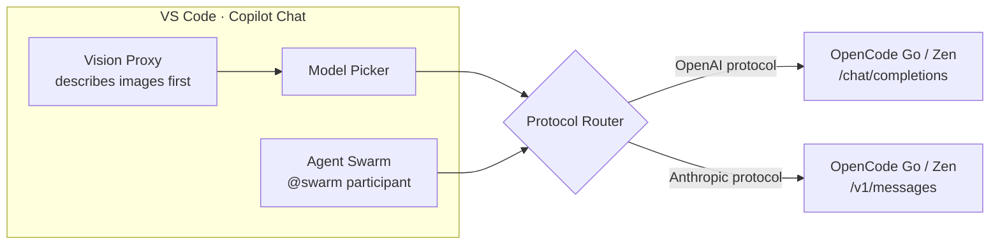
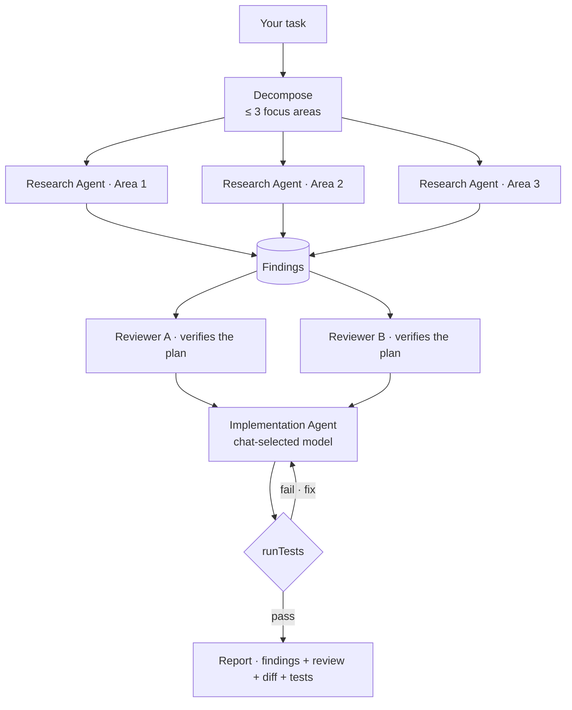
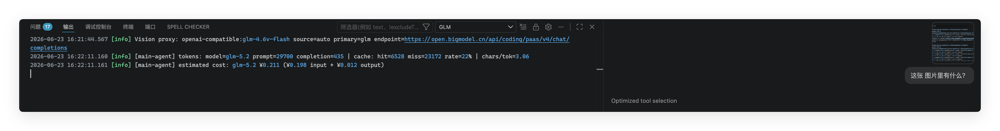

<h1 align="center">OpenCode for Copilot Chat</h1>

<p align="center">
  <!-- marketplace-readme:remove-start -->
  
  <br/>
  
  
  
  
  
  <!-- marketplace-readme:remove-end -->
</p>

<p align="center">
  <b>31+ open coding models — GLM, Kimi, DeepSeek, Claude, Grok, Qwen — inside Copilot Chat's model picker, with vision, thinking mode, and a multi-agent swarm.</b>
</p>

<p align="center">
  
</p>

## Quick Start

1. **Get a key** — subscribe at [opencode.ai/auth](https://opencode.ai/auth) ([Go](https://opencode.ai/docs/go/) or [Zen](https://opencode.ai/docs/zen)) and copy your API key.
2. **Set it** — run **OpenCode: Set Go/Zen API Key**; it lands in your OS keychain, never on disk. One key works for both Go and Zen.
3. **Chat** — pick any of the 31+ models in Copilot Chat, or type `@swarm` and let a team of agents do the work.

## Why this extension?

You already have Copilot's agent mode, tool calling, MCP, and skills. What you might not have is the *models you want to run them on*. This extension keeps the entire Copilot stack and swaps the brain:

- **Don't replace Copilot — power it up.** No sidebar, no new UI. Just a new model in the picker you already use.
- **One API key, 31+ models.** 14 OpenCode Go + 17 Zen models (5 free): GLM, Kimi, DeepSeek, Claude, Grok, Qwen, MiMo, MiniMax, Big Pickle, and more.
- **Protocols handled for you.** OpenAI `/chat/completions` for GLM/Kimi/DeepSeek/Grok/MiMo, Anthropic `/v1/messages` for Claude/MiniMax/Qwen — routed automatically per model.
- **Everything Copilot gives you still works.** Agent mode, tools, instructions, MCP, skills — untouched, now on your OpenCode subscription.
- **Zero runtime dependencies.** Pure VS Code API + Node.js built-ins. No Python, no Docker, no proxy process to babysit.

<p align="center">
  
</p>

## Architecture at a Glance



Every model is routed to the endpoint it speaks natively, images are described before they reach the model, and the Agent Swarm orchestrates parallel agents — all inside the model picker you already know.

## Features

### 🐝 Agent Swarm — parallel agents on one task (`@swarm`)

Type `@swarm` and a team of autonomous agents takes over: **research agents explore the codebase in parallel, review agents verify the plan before a single line is written, and an implementation agent — on the exact model you have selected — does the work and runs the tests.**



- **Every agent is autonomous** — its own tool loop and turn budget. Research and review are read-only; only the implementer edits.
- **Resilient by design** — a rate-limited or failed sub-agent degrades to a marked note; the swarm never sinks.
- **Your model, your cost** — research/review default to free models; implementation always runs on the model you picked.

> Role models are configurable via `opencode-for-copilot.agentRoles` — see [Settings](#settings).

### 👁 Transparent Vision Proxy

Drop a screenshot into chat and the proxy describes it *before* the model sees it — GLM-5.2 focuses on code while GLM-4.6V-Flash handles the pixels. Falls back to any installed VS Code vision model automatically.

<p align="center">
  
</p>

### 🧠 Thinking Mode with Reasoning Effort Control

Full `reasoning_content` support on GLM-5.2/5.1 and Claude models. Pick `none` / `high` / `max` per model from Copilot Chat's native picker menu.

### 🦥 Ponytail — Lazy Senior Dev Verification

Every **coding** request carries a Ponytail-style system instruction that makes the model think like a lazy senior developer — efficient, not careless. Before writing any code it climbs a 7-rung ladder:

1. **Does this need to be built at all?** (YAGNI)
2. **Does it already exist in the codebase?** Reuse it.
3. **Does the standard library do this?** Use it.
4. **Does a native platform feature cover it?** Use it.
5. **Does an already-installed dependency solve it?** Use it.
6. **Can this be one line?** Make it one line.
7. **Only then:** write the minimum code that works.

Three intensity modes — `lite` (reminder), `full` (complete ladder, default), `ultra` (strict, edge-case-first) — plus `off`. Injected **only** into real coding requests; utility calls stay lean and cheap. Switch live with **OpenCode: Set Ponytail Mode**.

### 🧹 Code Simplifier — Autonomous Code Refinement

An always-on refinement agent (inspired by the [Claude Code Simplifier plugin](https://claude.com/plugins/code-simplifier)) that reviews recently modified code and flattens nesting, kills redundancy, renames vague identifiers, and replaces chained ternaries — while **never** changing behaviour, API signatures, or safety checks. When active, Ponytail auto-downgrades to Lite for compatibility.

### ♻️ Inherits Every Copilot Capability

Because the extension plugs into Copilot's native provider API, you keep the full stack for free: **agent mode**, tool calling, instructions & skills, MCP, and prompt-caching stats.

### 💰 Cost Visibility · 🔒 Security by Default

- Per-turn list-price estimates in the status bar and logs — USD on all OpenCode endpoints (CNY if you point `baseUrl` at a domestic GLM endpoint manually).
- API key in VS Code `SecretStorage` (OS keychain) — never in `settings.json`, never in Git history.

## Getting Started

### Prerequisites

- VS Code 1.116 or later. This extension relies on non-public Copilot Chat APIs that may break on newer VS Code versions — [report an issue](https://github.com/abbalochdev/opencode-for-copilot/issues) if you hit one.
- GitHub Copilot subscription (Free / Pro / Enterprise — the free tier works)
- **OpenCode account** — [Go subscription](https://opencode.ai/docs/go/) ($5 for your first month, then $10/month) or [Zen pay-as-you-go](https://opencode.ai/docs/zen). Subscribe at [opencode.ai/auth](https://opencode.ai/auth) and copy your API key — one key works for both.

### Installation

Install from the registry used by your editor:

1. **Microsoft VS Code** — install from [VS Code Marketplace](https://marketplace.visualstudio.com/items?itemName=abbalochdev.opencode-for-copilot).
2. **Editors that use Open VSX** — install from [Open VSX](https://open-vsx.org/extension/abbalochdev/opencode-for-copilot).

### Usage

1. Subscribe to [OpenCode](https://opencode.ai/docs/) and copy your API key from [opencode.ai/auth](https://opencode.ai/auth)
2. Run **OpenCode: Set Go/Zen API Key** from the Command Palette (`Cmd+Shift+P` / `Ctrl+Shift+P`)
3. Paste your OpenCode API key — it's stored in VS Code's secure SecretStorage (OS keychain)
4. Open Copilot Chat, click the model picker, pick any OpenCode model (GLM-5.2, Kimi K2.7 Code, DeepSeek V4 Flash, Claude Sonnet 5, etc.)
5. That's it — chat away!

## Models

All OpenCode Go & Zen models are available. The extension automatically routes each model to the correct endpoint protocol, and prefixes every picker entry with its billing path (`go/GLM-5.2`, `zen/Claude Sonnet 5`) so you always know which plan a model draws from:

### OpenAI endpoint (OpenCode Go / Zen)

| Model                | Best For                                   | Source    |
| -------------------- | ------------------------------------------ | --------- |
| **GLM-5.2**          | Flagship coding & reasoning, 1M context     | Go        |
| **GLM-5.1**          | High-quality coding & reasoning             | Go        |
| **Grok 4.5**         | Frontier reasoning (xAI)                    | Go        |
| **Grok Build 0.1**   | Coding-tuned reasoning (xAI)                | Zen       |
| **Kimi K3**          | Frontier reasoning model                    | Go        |
| **Kimi K2.7 Code**   | Coding-tuned reasoning model                | Go        |
| **Kimi K2.6**        | General coding & reasoning                  | Go        |
| **DeepSeek V4 Pro**  | High-quality reasoning                      | Go        |
| **DeepSeek V4 Flash**| Fast and economical coding                  | Go        |
| **MiMo V2.5**        | Fast and economical coding                  | Go        |
| **MiMo V2.5 Pro**    | High-quality reasoning                      | Go        |

### Anthropic endpoint (OpenCode Go / Zen)

| Model               | Best For                                   | Source    |
| ------------------- | ------------------------------------------ | --------- |
| **Claude Fable 5**   | Frontier reasoning (Anthropic)             | Zen       |
| **Claude Opus 4.8**  | High-quality reasoning                     | Zen       |
| **Claude Opus 4.7**  | High-quality reasoning                     | Zen       |
| **Claude Opus 4.6**  | High-quality reasoning                     | Zen       |
| **Claude Opus 4.5**  | High-quality reasoning                     | Zen       |
| **Claude Sonnet 5**  | Balanced reasoning                         | Zen       |
| **Claude Sonnet 4.6**| Balanced reasoning                         | Zen       |
| **Claude Sonnet 4.5**| Balanced reasoning                         | Zen       |
| **Claude Haiku 4.5** | Fast economical model                      | Zen       |
| **MiniMax M3**       | Coding agent work                          | Go        |
| **MiniMax M2.7**     | Coding agent work                          | Go        |
| **MiniMax M2.5**     | Coding agent work                          | Go        |
| **Qwen3.7 Max**      | Top-tier reasoning (256K context)          | Go        |
| **Qwen3.7 Plus**     | Cost-effective reasoning (1M context)      | Go        |
| **Qwen3.6 Plus**     | Cost-effective reasoning (256K context)    | Go        |
| **Qwen3.5 Plus**     | Cost-effective reasoning (Anthropic)       | Zen       |

### Free models (OpenCode Zen — OpenAI endpoint)

| Model                     | Notes                                       |
| ------------------------- | ------------------------------------------- |
| **Big Pickle**            | Free stealth coding model (limited time)     |
| **DeepSeek V4 Flash Free**| Free fast coding model (limited time)        |
| **MiMo V2.5 Free**        | Free fast coding model (limited time)        |
| **North Mini Code Free**  | Free coding model (limited time)             |
| **Nemotron 3 Ultra Free** | Free NVIDIA trial model (limited time)       |

> Free models are available for a limited time and **may collect data** to improve the model. See [Zen privacy docs](https://opencode.ai/docs/zen#privacy) for details.

All models support tool calling. GLM-5.2, GLM-5.1, and Claude (Fable 5, Opus, Sonnet) support thinking mode with reasoning effort control (`none` / `high` / `max`). Image attachments go through the Vision Proxy.

## Settings

| Setting                                      | Default                   | Description                                                                                                                                                                                                                                                                                                                                                                                                                                                                                                                   |
| -------------------------------------------- | ------------------------- | ----------------------------------------------------------------------------------------------------------------------------------------------------------------------------------------------------------------------------------------------------------------------------------------------------------------------------------------------------------------------------------------------------------------------------------------------------------------------------------------------------------------------------- |
| `opencode-for-copilot.opencodePlan`          | `go`                      | Active OpenCode plan (`go` subscription or `zen` pay-as-you-go). Picks your default endpoint; the picker always lists the full Go+Zen catalog, prefixed `go/…` or `zen/…` by billing path |
| `opencode-for-copilot.endpoint`              | `opencode-go`             | Single-value endpoint selector. `opencode-go` / `opencode-go-anthropic` serve OpenCode Go subscription models; `opencode-zen` / `opencode-zen-anthropic` serve OpenCode Zen pay-as-you-go models (including Claude and free models) |
| `opencode-for-copilot.baseUrl`               | empty                     | Optional API endpoint override. When non-empty, overrides the `endpoint` preset. |
| `opencode-for-copilot.maxTokens`             | `0`                       | Max output tokens (`0` = no limit). Useful for cost control                                                                                                                                                                                                                                                                                                                                                                                                                                                                   |
| `opencode-for-copilot.modelIdOverrides`      | prefilled OpenCode IDs   | API model IDs to send for built-in or custom models. Change only for compatible endpoints with different model names                                                                                                                                                                                                                                                                                                                                 |
| `opencode-for-copilot.customModels`          | `[]`                      | Extra OpenCode-compatible models for the picker. Accepts string IDs or objects with `id`, optional `name`, token limits, `toolCalling`, and `thinking`. Custom IDs override built-ins. Images still go through the current Vision Proxy; custom models do not bypass it for native vision                                                                                                                                                                                                                                     |
| `opencode-for-copilot.debugMode`             | `minimal`                 | Diagnostic mode: `minimal` for token usage only, `metadata` for privacy-preserving logs, or `verbose` for full request dumps and pipeline snapshots under extension global storage. Full dumps may include sensitive prompt text, tool schemas, file snippets, and image descriptions. Use `OpenCode: Open Request Dumps Folder` to open the dump location                                                                                                                                                                        |
| `opencode-for-copilot.visionModel`           | _(auto)_                  | VS Code vision model used as fallback when automatic vision is unavailable. Configure from `OpenCode: Configure Vision Proxy`; new saves use `vendor/id`, while legacy bare model IDs are still read                                                                                                                                                                                                                                                                                                                |
| `opencode-for-copilot.visionPrompt`          | _(built-in)_              | Prompt used to describe image attachments                                                                                                                                                                                                                                                                                                                                                                                                                                                                                     |
| `opencode-for-copilot.ponytailMode`          | `full`                    | Ponytail coding-discipline system instruction level. `off` = no instruction; `lite` = brief reminder; `full` = complete 7-rung ladder with all rules; `ultra` = strict mode prioritizing edge-case correctness. Use `OpenCode: Set Ponytail Mode` to switch at runtime                                                                                                                                                                                                                                                         |
| `opencode-for-copilot.codeSimplifier`        | `true`                    | Autonomous code refinement agent (on by default). Proactively reviews modified code and simplifies for clarity, consistency, and maintainability. When enabled, Ponytail auto-downgrades to Lite. Toggle with `OpenCode: Toggle Code Simplifier`                                                                                                                                                                                                                                                                               |
| `opencode-for-copilot.agentRoles`            | `{}`                      | Models per agent-swarm role: `research` (list, round-robin — defaults to free DeepSeek V4 Flash Free), `implement` (always the chat-selected model), and optional `review` (list, defaults to free Big Pickle). Each entry is `{ "vendor", "family", "id"? }`                                                                                                                                                                                                                                                                 |
| `opencode-for-copilot.experimental.stabilizeToolList` | `false`          | Experimental.Tries to pre-activate VS Code/Copilot virtual tools so the API `tools` parameter is more complete and stable across turns. May improve context-cache hit rate when enabled tools change between turns. Can increase input tokens because more function definitions may be included; cache-hit input tokens are cheaper but still count toward usage. Usually leave it off with 64 or fewer enabled tools unless the tool list still changes across turns; do not enable it with more than 128 enabled tools |

Thinking Effort is configured from Copilot Chat's model picker for each thinking-capable GLM model.

Example `settings.json` for a custom API proxy:

```json
{
  "opencode-for-copilot.baseUrl": "https://proxy.example.com/v1",
  "opencode-for-copilot.customModels": [
    "my-model",
    {
      "id": "team-coder",
      "name": "Team Coder",
      "maxInputTokens": 200000,
      "maxOutputTokens": 131072,
      "toolCalling": true,
      "thinking": true
    }
  ],
  "opencode-for-copilot.modelIdOverrides": {
    "glm-5.2": "your-glm-5.2-model-id"
  }
}
```

## Troubleshooting

### OpenCode models are missing from the agent / background agent model picker

Recent VS Code versions gate custom providers from the background agent and the new agent window. If you can pick OpenCode models in the editor chat but not in the agent window, add the extension to the allowlist in `settings.json`:

```json
{
  "extensions.supportUntrustedWorkspaces": true,
  "extensions.supportAgentsWindow": {
    "abbalochdev.opencode-for-copilot": true
  }
}
```

If the agent still refuses to start with `No utility model is configured for 'copilot-utility-small' while the selected main model is BYOK`, that is a known VS Code Copilot regression — see [microsoft/vscode#324007](https://github.com/microsoft/vscode/issues/324007). Switching the editor chat to an OpenCode model usually works while the upstream issue is open.

### HTTP 400 `Invalid schema for function '...'` from a proxy or relay

This extension targets the OpenCode (Go & Zen) endpoints only. VS Code/Copilot generates the tool schemas verbatim from its own tool definitions and forwards them as-is. Third-party relays or proxies (e.g. New API, OneAPI) often enforce stricter OpenAI-schema validation than the official endpoint and reject schemas that contain `default: null`, certain `anyOf`/`oneOf` shapes, or other minor deviations — the most common symptom is `Invalid schema for function 'get_errors': null is not of type "array"`.

This is **not** something this extension sanitizes, by design:

- We forward exactly what VS Code/Copilot produces, so any compatibility fix that works on the official endpoint is preserved.
- Maintaining per-relay quirks would create an ever-growing patch surface that can mask real upstream bugs.

If you hit this on a relay, the supported options are:

- Switch `opencode-for-copilot.baseUrl` back to an OpenCode endpoint (leave empty and use `endpoint`).
- Open a request dump with **OpenCode: Open Request Dumps Folder** and inspect the offending tool schema, then report the strict-validation bug to your relay.
- The error is also written to the OpenCode output channel — you can copy the full server response from there.

## Coexistence & Recent Fixes (v3.9.1 → v3.11.0)

This fork originated from *GLM for VSCode Copilot* and reused its identifiers. Installing both side by side caused them to fight over the same global namespaces. Everything is now namespaced independently, so **both extensions can be installed at the same time**.

| Surface | Before (collided with upstream) | Now |
| --- | --- | --- |
| Command IDs | `glm-copilot.setApiKey` … | `opencode-for-copilot.setApiKey` / `refreshModels` / … |
| Model vendor | `glm` (model IDs `glm/glm-5` …) — same IDs as upstream, so picker entries crossed over between extensions | `opencode` (`opencode/glm-5`, `opencode/gpt-5.6-luna`, …) |
| API keys | One shared key slot | Still one key — OpenCode Go is a subscription add-on on your Zen account, so a single key from opencode.ai/auth works for both endpoint families |
| Settings section | `glm-copilot.*` (shared — configuring one extension changed the other) | `opencode-for-copilot.*` (one-time migration of existing values; the old section is never read again) |
| Output channel | `GLM` (both extensions logged into one channel) | `OpenCode` |

Key features introduced along the way:

- **Full model catalog** — the `opencode-for-copilot.opencodePlan` setting (`go`, default, or `zen`) picks your default endpoint; every Go and Zen model is listed either way, each prefixed with its billing path (`go/GLM-5.2`, `zen/Claude Sonnet 5`). Picking a `zen/…` model without credits fails with a clear message instead of a cryptic 401.
- **Live model catalog** — the list is fetched from the official OpenCode endpoints and re-fetched when stale: opening the picker past the TTL refreshes in the background, failed fetches retry after 60 s instead of serving the static fallback for 5 minutes (covers starting VS Code before your VPN is up), and **OpenCode: Refresh Model List** forces an immediate re-fetch.
- **Clearer errors** — a Zen-only-model billing failure explains that the *model choice* is the problem, not the API key.
- **Agent swarm participant** moved to `opencode-for-copilot.pipeline` (re-type `@swarm` once after updating).

### Stale model-picker entries ("ghost" models that no longer work)

VS Code caches per-model state (pinned, recently used, selected) under `vendor/id`. If you used earlier builds of this extension (or sibling forks like `ltmoerdani.opencode-copilot-chat`), those vendors (`opencodego/…`, `glm/…`) may leave ghost entries pinned at the top of the picker. Uninstall the other fork(s), then clear the leftovers:

```powershell
# Close all VS Code windows first, then:
node -e "const {DatabaseSync}=require('node:sqlite');const p=process.env.APPDATA+'/Code/User/globalStorage/state.vscdb';const db=new DatabaseSync(p);for(const k of ['chatModelPinned','chatModelRecentlyUsed']){const r=db.prepare('SELECT value FROM ItemTable WHERE key=?').get(k);const l=JSON.parse(r.value);const c=l.filter(id=>!id.startsWith('opencodego/')&&!id.startsWith('opencodezen/'));db.prepare('UPDATE ItemTable SET value=? WHERE key=?').run(JSON.stringify(c),k);console.log(k,c)}"
```

## Compared to alternatives

|                           | This extension | Local proxy (e.g. LiteLLM) | Standalone GLM extensions |
| ------------------------- | -------------- | -------------------------- | ------------------------- |
| Works inside Copilot Chat | ✅             | ✅                         | ❌ separate UI            |
| Agent mode, tools, skills | ✅             | ✅                         | ⚠️ reimplemented          |
| Vision support            | ✅ proxied     | ❌                         | ❌                        |
| No extra process to run   | ✅             | ❌                         | ✅                        |
| One-click install         | ✅             | ❌                         | ✅                        |
| API key in OS keychain    | ✅             | ❌                         | ⚠️ varies                 |

## Acknowledgements

This extension is a **fork and rebrand** of [**GLM for VS Code Copilot**](https://marketplace.visualstudio.com/items?itemName=ikaros.glm-for-vscode-copilot) by [ikaros](https://github.com/umbrella22/glm-for-copilot), published under the MIT License. We thank the original author for the high-quality BYOK Copilot Chat provider implementation, vision proxy, and cost estimation infrastructure that make this OpenCode extension possible.

This project also references ideas and implementation patterns from [Vizards/deepseek-v4-for-copilot](https://github.com/Vizards/deepseek-v4-for-copilot), [KiwiGaze/glm-for-copilot](https://github.com/KiwiGaze/glm-for-copilot), and [selfagency/z-models-vscode](https://github.com/selfagency/z-models-vscode). Thanks to the original authors. Where applicable, redistribution and derivative work should preserve the original MIT License notices.

## License

[MIT](LICENSE)
